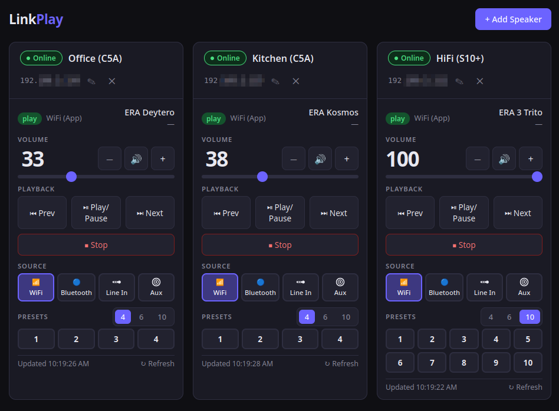

# LinkPlay WebUI

A single-file browser interface for controlling LinkPlay-based Wi-Fi speakers — no server, no dependencies, no install.

> Supports any speaker running LinkPlay firmware (Arylic, Audio Pro, Dayton Audio, iEast, Muzo, and many others).

---

## Features

- **Multiple speakers** — add as many as you need, each in its own card
- **Volume control** — slider, step buttons, and mute toggle
- **Playback control** — previous, play/pause, next, stop
- **Source switching** — Wi-Fi, Bluetooth, Line In, Aux
- **Presets** — trigger saved presets (4, 6, or 10 per speaker)
- **Live status** — now playing, artist, playback state, source (requires CORS extension, see below)
- **Persistent** — speaker list and settings survive page reloads via `localStorage`
- **Responsive** — 1–3 speakers side by side, 4+ in a 2-column grid; collapses to single column on mobile

## Usage

### Local

Download `index.html` and open it in a browser. Enter each speaker's local IP address and click **+ Add Speaker**.

That's it — no build step, no server required.

### Online on GitHub Pages

Visit http://lpui.srm.gr/ and try it out, or use it as your daily driver.

CAVEATS: The WebUI only works over `http` and not `https` as the speakers themselves in your local network do not
have `https`. **Browsers block HTTP requests from HTTPS pages (mixed content). There's no easy/singlefile way around this.**

## CORS limitation

Browsers block cross-origin responses from local devices that don't send CORS headers. LinkPlay firmware does not.

**This means controls (volume, source, presets, playback) work fine** — they use `no-cors` fetch requests that reach the device without the browser needing to read the response. **Live status updates require a browser extension** that injects the missing header:

| Browser       | Extension                                                                                                          |
|---------------|--------------------------------------------------------------------------------------------------------------------|
| Firefox       | [CORS Everywhere](https://addons.mozilla.org/en-US/firefox/addon/cors-everywhere/)                                 |
| Chrome / Edge | [Allow CORS](https://chrome.google.com/webstore/detail/allow-cors-access-control/lhobafahddgcelffkeicbaginigeejlf) |

Enable the extension, reload the page, and status will start updating.

If you prefer not to use an extension, you can run a local reverse proxy (nginx, Caddy, etc.) that forwards requests to the speaker and adds the `Access-Control-Allow-Origin: *` header.

## API(s) used

This project is primarily based on the community-documented [n4archive/LinkPlayAPI](https://github.com/n4archive/LinkPlayAPI/blob/master/api.md) and was also compared against the official [Arylic HTTP API](https://developer.arylic.com/httpapi), both of which document the same underlying LinkPlay firmware.

## What is implemented

| Feature             | Command                                   |
|---------------------|-------------------------------------------|
| Volume set          | `setPlayerCmd:vol:<n>`                    |
| Mute / unmute       | `setPlayerCmd:mute:<0\|1>`                |
| Play / pause toggle | `setPlayerCmd:onepause`                   |
| Stop                | `setPlayerCmd:stop`                       |
| Next / Previous     | `setPlayerCmd:next` / `setPlayerCmd:prev` |
| Play stream URL     | `setPlayerCmd:play:<url>`                 |
| Source switching    | `setPlayerCmd:switchmode:<source>`        |
| Presets             | `MCUKeyShortClick:<n>`                    |
| Player status       | `getPlayerStatus`                         |

### Not yet implemented

The following features are not yet implemented but documented in the Arylic API:

- **Additional sources** — `line-in2`, `optical`, `co-axial`, `udisk` (USB storage), `PCUSB` (USB DAC)
- **Loop / shuffle mode** — `setPlayerCmd:loopmode:<0-5>`
- **Seek** — `setPlayerCmd:seek:<seconds>` (requires a progress bar)
- **M3U playlist** — `setPlayerCmd:m3u:play:<url>` (the Stream URL field only supports direct streams)
- **Multiroom** — `ConnectMasterAp`, `multiroom:getSlaveList`, `multiroom:SlaveVolume`, etc.
- **USB / local playback** — `getLocalPlayList`, `setPlayerCmd:playLocalList:<n>`
- **Notification audio** — `playPromptUrl:<url>`
- **Track position / playlist info** — `curpos`, `totlen`, `plicurr`, `plicount` are returned by `getPlayerStatus` but not displayed

## Supported sources

| Button    | API command            | Mode(s) |
|-----------|------------------------|---------|
| Wi-Fi     | `switchmode:wifi`      | 1–29    |
| Bluetooth | `switchmode:bluetooth` | 41      |
| Line In   | `switchmode:line-in`   | 40      |
| Aux       | `switchmode:aux`       | 43, 44  |

Source availability depends on the speaker model. The API documentation defines modes 40–49 as the Line In family (`PLAYER_MODE_LINEIN` through `PLAYER_MODE_LINEIN_MAX`). Mode 43 is listed as Optical/SPDIF and mode 44 is undocumented, but both are observed as Aux inputs depending on the device.

## Presets

Presets are triggered via `MCUKeyShortClick:N`, which simulates pressing a hardware preset button. Most LinkPlay devices support 4–6 presets; some support up to 10. The count is configurable per speaker in the UI and saved across reloads.

---

## Credits

- Built by [Bill Seremetis (bserem)](https://github.com/bserem).
- With the assistance of [Claude](https://claude.ai) by Anthropic.
- API documentation by [n4archive/LinkPlayAPI](https://github.com/n4archive/LinkPlayAPI/blob/master/api.md).

---

## License

MIT
